PROJECT TITLE:

Intelligent Question Answering System for University Policy Documents

SUBMITTED BY:

OBIORA ORAKWUE

20221870

SUBMITTED TO:

DEPARTMENT OF COMPUTER SCIENCE,

FACULTY OF COMPUTING,

NILE UNIVERSITY OF NIGERIA

IN PARTIAL FULFILMENT OF THE REQUIREMENTS FOR THE AWARD OF BACHELOR OF COMPUTER SCIENCE (B.Sc.) DEGREE IN COMPUTER SCIENCE IN THE FACULTY OF COMPUTING

DATE: 14/05/2026

SUPERVISOR: PROF NOAH AKANDE

Table Of Contents

Chapter One - Introduction

1.0 Introduction

The administration of modern higher education institutions is governed by an extensive and complex framework of official policies, guidelines, regulations, and procedures. These institutional documents—ranging from comprehensive undergraduate student handbooks, academic regulations, and examination policies, to departmental guidelines and codes of conduct—serve as the operational foundation for academic and administrative decision-making. They are designed to guarantee transparency, equity, and consistency across all university operations, providing students and staff with a clear roadmap of their rights, responsibilities, and institutional requirements. Consequently, the ability of university stakeholders to easily access, interpret, and comply with these policies is crucial for maintaining academic integrity, optimizing administrative efficiency, and fostering a supportive student experience.

However, the sheer volume, length, and dense bureaucratic language of these documents often present a significant barrier to effective information retrieval. Traditional institutional databases typically store these documents as large, monolithic PDF files or physical brochures. When students or staff members need to resolve specific, time-sensitive queries—such as course registration deadlines, graduation requirements, examination regulations, or grading appeal procedures—they are forced to manually sift through hundreds of pages of text or rely on basic, keyword-based search engines. These legacy search engines frequently fail to capture the semantic context of a user's question, leading to irrelevant search results or missing critical details when users express their queries using synonyms or natural phrasing. This search friction often results in student frustration, non-compliance with academic rules, or an administrative bottleneck, as students resort to visiting administrative offices in person for routine questions.

To address these challenges, recent advancements in Artificial Intelligence (AI) and Natural Language Processing (NLP) offer a transformative paradigm. The evolution of large language models (LLMs) and dense vector embeddings has paved the way for semantic search systems that can comprehend the actual meaning behind natural language queries. Specifically, Retrieval-Augmented Generation (RAG) has emerged as a state-of-the-art framework that bridges the gap between pre-trained language models and private, domain-specific document repositories. By indexing document chunks as mathematical vector embeddings in a dedicated vector database and retrieving only the most semantically relevant context at query time, RAG-enabled conversational agents can generate accurate, contextually grounded answers that cite official sources, thereby mitigating the risk of factual hallucinations.

This study proposes the design, development, and evaluation of an Intelligent Question Answering System for University Policy Documents. The system leverages the orchestration capabilities of LlamaIndex, the efficient storage of ChromaDB, and the advanced reasoning capabilities of the Google Gemini 2.5 Flash model. By implementing this system, the research aims to provide university stakeholders with an interactive, natural-language interface that delivers immediate, accurate, and contextually relevant answers grounded in official university policies, thereby reducing administrative workloads and enhancing information accessibility.

This dissertation is structured into five distinct chapters. Chapter One introduces the research, outlining the background of the study, the problem statement, research questions, the study's aim and objectives, significance, scope, and limitations. Chapter Two provides a detailed literature review of relevant question answering technologies, NLP methods, and RAG architectures. Chapter Three presents the design and architectural framework of the proposed system. Chapter Four details the implementation, testing, and evaluation of the system's performance. Finally, Chapter Five concludes the study with a summary of findings and recommendations for future research.

1.1 Background of Study

There are a variety of official documents that govern the University environment; academic rules, administrative procedures and policies are some of those documents. These include students' handbooks, academic policies, departmental policies, policies on examinations, and codes of conduct. They are meant in such a way that they are consistent, transparent and just in their handling of academic and administrative affairs. In the case of students, the documents are used as the main sources of information on their rights, duties, and academic needs. They are relevant but information about them is generally not readily available in policy documents in Universities. Most of these documents are lengthy taking dozens or even hundreds of pages and they are written using formal language which is not easily comprehended by all users.

Those students who need to find the answer of some questions, like when they need to register their courses, examine or graduated, can hardly get the answer of some questions within a short time. This means that users are likely to need to spend a considerable amount of time to locate the information they require in documents or turn to unofficial sources that can have inaccurate information. With the advancement of Artificial Intelligence (AI) and Natural Language Processing (NLP), today, it is possible to enrich the interaction with the very large text documents. They can assist a computer in understanding and interpreting human speech and can assist a person in creating a computer-based system that has reasoning capabilities about the users' question. One of the important applications of NLP is Question Answering (QA) systems, which enable the user to ask questions in natural language and get a direct answer in the form of questions, which are extracted from a document or a database. That has been bolstered by recent advances in deep learning that have led to more powerful modern QA systems, such as transformational models like BERT and its derivatives. Gemini 2.5 Flash (RAG) is a highly efficient, state-of-the-art multimodal large language model that delivers high accuracy while minimizing local computing resource requirements by running via lightweight cloud API calls. This makes it highly suitable for real-time academic environments where performance and speed are crucial. The project thus incorporates policy-level NLP techniques that are applied to policy documents at the university to improve accessibility to information that would otherwise be hard to locate and reduce stress of manual searching.

1.2 Problem Statement and Research Questions

1.2.1 Problem Statement

Whilst easy to access, university policy documents are not always user friendly with respect to accessing information. Students and members of staff tend to have a problem in finding particular answers in large and unorganized documents. Manual reading takes time and the simple key word search engines do not always yield the right information, or, don't try to grasp the meaning of the query given by the user. This may cause confusion, misreading of the policies and/or non-compliance with the policies that apply.

If it is not possible to have a smart system in place which can be used to answer queries in natural language, then users will usually have to go to administrative offices to seek clarity. This reliance adds up the amount of work of the administrative staff and delays communication in the institution. Moreover, misinformation can be caused by inconsistent responses of various sources. The problems featured here demonstrate the need for a system that can automatically be able to extract appropriate and contextually relevant answers from official documents.

1.2.2 Research Questions

The study will try to address the following questions:

How to use NLP models which are based on transformers to identify accurate answers from university policy documents?

How much better can a context-optimized Gemini 2.5 Flash (RAG) model be used to answer document- based questions than a search method based on keywords?

What are the effectiveness rates of an AI-powered Question Answering System to improve access to information for students and staff?

What are the potential transformer models to apply in long and unstructured policy documents and its implementation challenges?

1.3 Significance of Study

The impact of this research is clear due to showing the potential application of the modern AI in solving a practical problem in the context of the problem of the university. The project can enhance the access to information for students and teachers by creating a system that can directly access the policy document when responding to questions with Natural Language. It also eliminates the reliance of administration staff on administrative enquiries and hence enhances the efficiency of the institutions.

From a technical perspective, the project will make its contribution to the use of transformer-based models in document-based information retrieval. It can also be used in future research and development of the AI-based system in the learning institutions, especially in developing countries where the availability of information is an issue in most cases.

1.4 Aim and Objectives of the Study

This part provides a general purpose of the research and the specific purposes that are required to achieve the overall purpose.

1.4.1 Study Aim

This project will focus on designing and deploying an AI-based Question Answering System, which is based on the transformer-based natural language processing methods to give correct and context-relevant responses to queries on policy documents within the university.

1.4.2 Objectives

The following objectives will be followed in the research to achieve the above purpose:

To explore the different question answering systems and natural language processing techniques available.

To help process and organize Policy documents in a University in a way that can be leveraged efficiently in a machine-learning-based system.

To optimize a Gemini 2.5 Flash (RAG) transformer model to generative question answering.

To conceptualize and develop a system that will accept natural-language queries and the appropriate answers.

To assess the system performance in terms of accuracy, relevance and usability.

1.5 Scope and Limitation of the Study

This section sets the scope of the study as it clearly shows what it is that the project will carry out and what the limitations will be during the project's development. The separation of the scope and limitations is useful in clarifying the scope of the research and gives a context on which the results of the system can be interpreted.

1.5.1 Scope of the Study

The main goal of this project is to build a generative Question Answering System for the policies of English-language universities. Documents on which the system concentrates are like student handbooks and academic regulations and are meant to get answers directly through them. In the paper, the application of transformer-based models is highlighted particularly Gemini 2.5 Flash (RAG) in a scholarly context, while it does not have an external scope such as knowledge bases or search engines.

1.5.2 Limitations of the Study

Although the proposed system is effective, the study has some limitations which can be categorized into technical, data related and operational limitations.

Technical Limitations: RAG pipelines rely on text chunking because large language models, despite having large context windows, can face context dilution or 'lost in the middle' phenomena when processing very long inputs. Dividing policy documents into chunks can occasionally lead to a loss of overall semantic context if information is split across boundaries. Moreover, while Gemini 2.5 Flash offers low latency and cost-effective API access, cloud-based dependencies introduce potential network latency and API availability requirements compared to local execution.

Note that the system is also an generative Question Answering model, which means that the system can only give an answer that can be found literally in the source documents. It is not able to come up with new explanations or to extrapolate on information that is not given. Furthermore, the performance of the system may vary depending on the limitations of the hardware can be experienced particularly on a machine having a limited processing power.

Data-Related Limitations: The quality, structure and fullness of the university policy documents used are key determinants of the accuracy and reliability of the system. Documentation that contains unclear terms, outdated policies, or different formatting can have a negative impact on the accuracy of the responses. In addition, it is only accessible to those who may need or want it in English, thus excluding the majority of people.

Operational and Social Limitations: In terms of operations, it would be adopted easily depending on the level of familiarity and trust of the users to the AI based solution. Some users might be more inclined towards a more conventional method of information retrieval or not wish to use an automatic system to obtain an official interpretation of the policy. Sometimes, the answers taken out of context could be misinterpreted if the entire policy context is not given to the users. Integration and institutional acceptance can also be a problem as the policy changes need to be maintained in the documents at all times to make sure that the system is precise and up-to-date.

1.6 Organization of the Study

This project report is in form of five chapters. The introduction of the research is in Chapter One where the background, problem statement, research questions, aim and objectives, scope, problem limitations and the definitions of key operational terms are presented. The literature review given in Chapter Two discussed existing literatures related with the literature survey of the question answering system, NLP techniques and transformer based model for this study. The system architecture analysis and design, design consideration of the proposed system will be discussed in chapter Three. Chapter Four focuses on information related to implementation of the systems, testing and evaluation of results. Lastly, Chapter Five closes the research by summarizing the results and giving a recommendation as to the future research and system enhancements.

Artificial Intelligence (AI): Computer science area that concerns the construction of systems that can perform intelligent acts, which humans typically can, such as learning, reasoning and making decisions.

Natural Language Processing (NLP): One of the types of Artificial Intelligence that tries to make computers understand and interpret human language meaningfully and contextually, meaningfully and contextually.

A Question Answering System: Software system capable of giving user a relevant and easy answer to his/her query in natural language from a given information source.

Transformer Model: This is a type of deep learning model, based on the self-attention mechanisms that model the contextual relationships in the text data, hence enhancing language understanding.

Gemini 2.5 Flash (RAG): A state-of-the-art transformer-based large language model from Google, optimized for high efficiency, fast inference, and low latency, making it highly effective for document-based retrieval and generation tasks.

Generative Question Answering: It is a question answering method whereby answers are directly obtained using the text available in the source document as opposed to the generation of answers and their inference outside the text.

University Policy Documents: These are the rules, procedures and policies as outlined in University documents including student manuals, University academic rules or University rules and procedures in specific departments.

Chapter Two

Literature Review

2.0 Concept of Artificial Intelligence

The term Artificial Intelligence (AI) refers to the design of a computer system that is able to learn, reason, make decisions and recognise patterns, functions that traditionally have been restricted to human intelligence. From being used as a knowledge-sharing tool in the form of a rule-based expert system, AI has progressed to what is now a data-driven machine learning system that can evolve and learn from experience and new data fed into it. AI is also used in the education sector in several applications like automatic grading, intelligent tutoring systems, recommendation systems, and information retrieval systems (Green & Brown, 2024). These are applications that are meant to enhance the efficiency and user experience. The current investigation uses AI to the issue of searching policy materials in the university, where the correct and timely information is highly valued to make a sound decision by students and employees.

2.1 Natural Language Processing

Natural Language Processing (NLP) is a branch of AI that is concerned with allowing computers to perceive and comprehend human language in a significant manner. NLP is a multi-disciplinary field of knowledge that uses the principles of linguistics, computer science and machine learning to understand and learn from a text. The early NLP systems were predominantly based on rules and grammar based approaches that were handcrafted and were difficult to scale, and failed when language became complex or unpredictable. As compared modern NLP methods make use of statistical models and neural networks to learn language representation using large datasets. Some of the important NLP activities include NER (Named Entity Recognition), POS (part of speech) tagging and semantic understanding. These tasks enable systems to go beyond simple keyword matching of surfaces in order to get deeper into language processing necessary to enable successful question answering.

2.2 Evolution of Question Answering Systems

Question Answering (QA) systems have been greatly changed over time. The existing QA systems were mostly domain-specific QA, hand-rule based systems, which required much manual effort involved in pattern specifying the questions and answers expected (Hirschman & Gaizauskas, 2001). They did not cope with variant languages or complex structure and were not very efficient in complex environments. The paradigm shift, going from a traditional QA system to a machine learning based system, was a large factor in the building of this QA system. Learning with the data rather than with only pre-determined rules was possible with the use of statistical models in the systems (Yih et al., 2015). However, the techniques still lacked a few limitations in respect of capturing the long distance dependencies and the context of the text. These limitations have led to the creation of models for transformer which are the foundation of the existing QA systems, because these models have a high rate of context and comprehension of sense.

2.3 Transformer Architecture

An important advancement in the field of Natural Language Processing (NLP) is transformer architecture. In contrast to classic sequence models, transformers are based on self-attention to find the relationship between the words in a sentence irrespective of their location (Vaswani et al., 2017). This enables the model to process text at the same time and have a better understanding of context, resulting in enhanced efficiency. This self attention is used to obtain the meaning of the words in their context in relation to the other words in the sentence, so that the model can produce representations (Vaswani et al., 2017). The mechanism is particularly beneficial for the case of QA tasks, in which an understanding of the relationship between a question and a text passage is crucial. The majority of the state-of-the-art NLP models, such as BERT and its variants are based on transformers.

2.4 Bidirectional Encoder Representations from Transformers (BERT)

BERT is a transformer-based, deep learning model, which recognizes representations of text in both directions. BERT unlike previous models that used a unidirectional approach in the handling of the text, it handles both the left and right context in tandem (Devlin et al., 2019). This two-way interpretation is useful for the model to obtain small meanings and optimise the results on a lot of NLP problems. BERT is trained on big collections of text without supervision by using next sentence prediction and masked language modeling tasks (Devlin et al., 2019). It can then be context optimized for specific tasks, e.g. question answering, with relatively small datasets from the domain of interest. Although it works effectively, the big size and computational complexity of BERT offer a challenge in implementing it in resource-constrained settings.

2.5 Gemini 2.5 Flash (RAG) and Model Optimization

Gemini 2.5 Flash (RAG) is a highly optimized model from Google's Gemini family, designed for high-speed inference, low latency, and reduced computational overhead (Gemini Team, 2023). Unlike traditional local models, it runs via API calls, which eliminates local memory constraints and reduces inference time on client systems while maintaining strong reasoning capabilities.

Question-answering systems based on documents are sensitive in terms of efficiency especially when handling several queries by users. Gemini 2.5 Flash is designed to accomplish tasks accurately and quickly, and can be easily integrated into academic environments where local computing resources are limited (Gemini Team, 2023). It leverages a serverless cloud infrastructure that scales to remain responsive under high concurrency without a drop in the quality of answers.

2.6 Generative Question Answering

Generative Question Answering refers to the task of choosing fragments of answers directly out of a text and not creating answers (Lewis et al., 2020). This will ensure that answers are related to the source text and, particularly for official policy documents, this will be the case. Generative QA systems determine the most pertinent part of the text answering the question of the user.

Generative QA offers transparency and reliability, in the context of policy documents in universities, since one can rely on the fact that the responses are based on validated institutional sources (Lewis et al., 2020). This feature is most suited for administrative or academic use in which generative QA would be used.

2.7 Document-Based Question Answering Systems

Document based QA systems are based on answering questions based on limited set of documents and not in general knowledge bases (Chen et al., 2017). Typically, these systems go through some pre-processing of documents, segmentation of passages and ranking for relevance before applying a QA model (Chen et al., 2017). The document-based QA challenges include coping with long documents, maintaining coherence in the context of the documents and ensuring that the right answers are pulled out of the document.

The policy documents in the university are usually very lengthy, and contain cross-referenced language in the other policy documents, which are not suitable for the conventional retrieval systems. It is possible to solve these problems with QA models based on transformers, which rely on embeddings of the text to be able to understand the semantics links between words and sentences (Zhang et al., 2021). This has enabled transformer based systems to be specifically applicable to institutional knowledge access platforms.

2.8 Limitations of the Existing System

The current approach is fraught with a number of drawbacks. Firstly, search engines that uses keywords to search the web can't understand the meaning of the users question and thus it can be hard to get the right answer to the user's search if he or she doesn't use the right keywords. Secondly, the manual search of a document is inefficient and time-consuming particularly when the users are in a hurry. Third, we don't have a single "smart" system that can directly answer questions and the same question will be repeated multiple times and it will take some time to get information. These limitations show that the existing system does not effectively and successfully facilitate access to information on the university's policy.

2.9 Related Works

A number of studies have researched on how AI and NLP can be used to answer questions. The models based on the transformer are proved to be more accurate and robust than the normal model, according to scholars. The studies show improved performance if there are domain-specific QA systems, with the improvements noted in the case of fine-tuning models using the appropriate domain datasets.

However, most of the literature that is available provides information on issues such as healthcare, legal matters and customer service. Few studies have been carried out on the QA system based on the transformer model in universities' policy documents. This is because the topicality and novelty of the current research can be determined from this gap. Below are some of the related works that are related to this system.

Survey of Question Answering Systems: Early and pioneering work on question-answering (QA) systems was done by Hirschman and Gaizauskas (2001) and looked at the evolution of the simplest search-through-keyword interfaces into those that use natural language input. QA systems were divided into three types: information retrieval based, rule based and natural language processing (NLP) based. The authors pointed out the challenge being faced by the early QA systems was lack of handling semantic intent and lack of providing correct answers. The conceptual basis for the future QA systems using machine learning was established in this work, where it was realized that language processing and semantics interpretation were important. But, the paper did not cover deep learning strategies, which restricts its use to the modern AI-based QA systems.

Deep Learning for Question Answering over Knowledge Bases: On the structured knowledge based question answering, Yih et al (2015) discussed the use of deep learning methods. Based on their research, they learned that they could feed a neural network natural language questions, and then generate a structured question that might be able to fetch them the information they needed more accurately. While no documents were considered unstructured, structured data was considered and consequently the relevance of semantic representation and embedding methods in attention came to the fore in this work. This article could be applied to the document-based QA systems, because it highlights the importance of deep learning in understanding the meaning of a document not only at the level of keywords. However, it is limited in its immediate use for document based policy QA systems, because of its reliance on structured knowledge bases.

Transformer Architecture in Natural Language Processing: The transformer architecture was introduced in a ground-breaking article named Attention Is All You Need by Vaswani et al. (2017). The authors propose a model, which is based only on self-attention mechanism, without using recurrent or convolutional neural networks. This architecture greatly enhanced the performance of different natural language processing applications such as translation, summarization and question answering. The fact that the transformer was able to model both long-range and contextual relationships made it especially appropriate in document comprehension. The basic principle of today's QA systems such as BERT, RoBERTa, and Gemini 2.5 Flash (RAG). The disadvantage of this original model was the value of the computed transformer would be very high, and needed to be lowered by other models.

Devlin et al. (2019) presented a pre-trained language model, BERT (Bidirectional Encoder Representations from Transformers) which successfully obtained state-of-the-art performance on several NLP benchmarks such as Stanford Question Answering Dataset (SQuAD). The authors showed that it is possible to use bidirectional training of BERT to enhance its understanding of the context better in a sentence. The BERT model is used in generative questions and answers (QA) tasks to identify the start and end of the answer to a query in a given passage. This can be directly adopted by a document-based QA system in which the answers need to be retrieved from a policy document(s). However, BERT is quite large and consumes a considerable amount of computing resources, so may not be suitable in resource-constrained environments.

The Gemini Team at Google (2023) introduced the Gemini family of models, including Gemini 2.5 Flash, which is optimized for high-frequency, low-latency tasks. Gemini 2.5 Flash utilizes advanced architectural designs to achieve performance comparable to larger frontier models while being significantly faster and more cost-effective. This makes Gemini 2.5 Flash highly applicable to real-time systems like web-based QA applications. Google validated these models across standard benchmarks for language understanding, reasoning, and context comprehension, demonstrating their robustness for institutional document QA tasks.

In this work, Chen et al. (2017) introduced a document-level quality assurance framework, consisting of information eliminating module and reading comprehension module. They first identify paragraphs of the relevant documents in massive document sets using their system, and then extract specific answers from the identified paragraphs using a neural reader. Helpful for the contents of a document being long (for example a policy manual or handbook) – a two-stage architecture. The paper points out the significance of the selection of the passages that precede the correct extraction of the answers. However, the efficiency of the retrieval stage is of paramount importance to the system's performance and any mistakes in the retrieval stage can be passed on to the final answer.

Lewis et al. (2020) compared the generative models with generative QA models and the pros and cons of both models were discussed. Generative models such as T5, BART output answers in natural language and generative models directly select the answer span directly from the source text. The authors discovered that generative models excel in applications requiring texture and factual correctness of the text, like law and policy documents. This justifies the selection of generative QA method of university policy systems. Generative models, on the other hand, can only be limited in terms of the source, which can be problematic in some cases with respect to readability.

Zhang et al. (2021) investigated the application of QA system in domain-specific application context, particularly in the legal and regulatory documents. They have demonstrated that, unlike general purpose QA models, the performance of transformer models can be improved by fine tuning them with data collected from a specific domain. The given finding is directly applied to the respective university policy documents that feature a certain language of the university and specific terminology. The attention of the research is on the importance of domain adaptation. The preparation of labelled domain-specific collection is yet a big challenge however, given the time and money required to label.

One of the reference points in measuring generative QA systems were proposed by Rajpurkar et al. (2016) in their work on Stanford Question Answering Dataset (SQuAD). They also considered the importance of reading comprehension, more than retrieval, as systems have to understand what they are reading to find the right answers. A large amount of annotated data that is fed into the data set to create a solid QA model. Although the dataset has been very useful for the study of QA, it is only for the relatively short passages of text found in Wikipedia; it may not be generalizable to longer institutional documents like policy manuals.

The researchers of Caciularu et al. (2019) explored the issue of implementing QA models to long documents especially those that are bigger than the range of input transformer. The authors suggested using document chunking, hierarchical attention mechanism to handle long contexts. They know, intuitively, that text segmentation and administration of context is important in dealing with long-standing texts of policies. Their method has led to improved performance, but it has also complicated the system design, and increased CPU time.

Voorhees and Tice (2000) have talked about the assessment techniques of QA systems. The fruits of their labour helped to develop the models of assessment that are adopted currently in the field of QA research.The results of their work helped to build the models of assessment that are widely used now in the QA research field.Their contribution in the field of assessment was to put down the standard assessment models which are still widely used in the contemporary QA research. These are measurable parameters that can be used to compare the performance of the system, and provide an optimization of the model. In real world applications like interpreting policies in the university context, however, traditional measures may be insufficient to reflect the satisfaction of the users or their contextual relevance.

Li et al. (2022) proposed a viable implementation of an organization's document-based document-based QA system. To provide real-time response to queries by consumers, the system was combined with PDF parsing, text chunking, vector embeddings, and transformer-based QA models. They discovered that by using A.I. inference along with the document preprocessing, the accuracy and usability of the system can be increased. The given work is quite similar to the proposed system as it will encounter with both technical and user experience problems. However, the work has revealed that there are scalability problems in the case of very large repositories of documents.

Dense Passage Retrieval for Open-Domain Question Answering: Karpukhin et al. (2020) proposed a dual-encoder framework that leverages dense representations to match questions and passages semantically in a shared vector space. Their methodology utilizes dense vector embeddings rather than traditional sparse retrieval (BM25) systems to improve query recall in open-domain QA tasks. This is highly relevant to university policy QA systems where students phrase questions in varying natural language formats that do not match the exact keywords in policy documents. However, a major limitation is its high memory footprint and dependence on GPU hardware to construct and search vector representations.

Retrieval-Augmented Generation for Knowledge-Intensive NLP Tasks: Lewis et al. (2020) combined pre-trained seq2seq models with a dense passage retriever in an end-to-end RAG architecture. This allows generative systems to access external document databases to retrieve relevant facts before generating response text. In university administration, this framework ensures that answers are grounded in specific policy passages, improving accuracy. The limitation remains that without strict prompting constraints, the generative model can still occasionally hallucinate text that is not in the source documents.

RAGAS: Automated Evaluation of Retrieval Augmented Generation: Es et al. (2023) developed RAGAS, an automated evaluation framework to measure RAG pipeline performance. It utilizes LLMs to evaluate three key parameters: faithfulness (factuality), answer relevance, and context recall without needing human ground truth annotations. This provides a repeatable framework for testing policy QA systems across different departments. However, the evaluation relies on high API costs and is heavily dependent on the reasoning capabilities of the evaluator LLM itself.

Lost in the Middle: How Language Models Use Long Contexts: Liu et al. (2024) studied how LLMs process information placed at different locations within long input context prompts. Their experiments showed that LLMs achieve high accuracy when relevant information is at the absolute beginning or end of the context, but performance degrades significantly when the information is placed in the middle. This highlights the importance of splitting university policy documents into smaller, overlapping chunks rather than inputting the entire handbook at once, although the paper itself does not provide a new chunking algorithm.

Active Retrieval Augmented Generation: Jiang et al. (2023) introduced FLARE, an active retrieval-augmented generation framework. Instead of retrieving context once at the start of the query, FLARE dynamically decides when and what to retrieve during the generation process based on the confidence scores of the tokens it is generating. This is highly useful for complex policy questions requiring multi-part answers. However, a significant limitation is the massive increase in API queries, which increases latency and token costs.

Chroma: An Open-Source Native Vector Database: Anton et al. (2023) designed ChromaDB as a lightweight, open-source embedded vector database that simplifies vector indexing and retrieval. It implements HNSW (Hierarchical Navigable Small World) graphs to enable fast semantic search over local vector collections. This makes ChromaDB ideal for academic setups where database administration overhead must be minimized. The main drawback is that it lacks native support for horizontal clustering, making it less scalable for large-scale enterprise deployments.

Evaluating the Impact of Chunking Strategies on RAG Systems: Reddy and Kumar (2024) analyzed how text segmentation strategies impact retrieval accuracy and response generation. They compared fixed-character chunking, sentence-level chunking, and sliding-window overlaps (e.g., 350-token window with 50-token overlap). They concluded that the sliding-window approach preserves context across boundaries, preventing information fragmentation. However, the optimal chunk sizes were found to be highly dependent on the layout and formatting styles of the specific document corpus.

Self-RAG: Learning to Retrieve, Generate, and Critique through Self-Reflection: Asai et al. (2023) proposed Self-RAG, a framework where a language model learns to retrieve passages dynamically and criticize its own outputs using self-reflection tokens. This ensures the model only retrieves context when necessary and evaluates whether the generated answer is faithful to the source material. While it reduces factual hallucinations in policy searches, the methodology requires specialized model fine-tuning, which is not feasible when using black-box proprietary APIs.

REPLUG: Retrieval-Augmented Black-Box Language Models: Shi et al. (2023) developed REPLUG, which treats the large language model as a black box and wraps it with a parallel retriever. It computes probability distributions over retrieved documents to guide the generation probability of the language model API. This demonstrates how cloud-hosted models like Gemini 2.5 Flash can be safely integrated into local retrieval pipelines. However, the document probability calculations add substantial computational overhead during inference.

University Chatbots: A Survey of Conversational Agents in Higher Education: Hobert and von Meyer (2020) conducted a systematic review of conversational agents implemented in academic institutions. They identified that chatbots are mainly used for administrative support, student orientation, and FAQs. They noted that students value instant response speeds but are often frustrated by rigid, rule-based systems. This highlights the need for generative QA models that can handle unstructured language, although their survey predates the widespread adoption of LLM-based architectures.

Large Language Models in Education: A Review of RAG Chatbots for Student Support: Martinez and Sanchez (2024) studied the real-world deployment of RAG-based chatbots at several universities. They verified that RAG architectures significantly reduce administrative workloads by handling routine inquiries about deadlines and regulations. The study found that providing clickable citations was the single most important factor in building student trust. The limitation of their research is the small sample size used to measure long-term user satisfaction.

Designing Chatbots for Higher Education Policy Retrieval: Thompson et al. (2022) explored user-centered design principles for building educational chatbots. They focused on how to present long, bureaucratic policies in small, digestible conversational bubbles. While their prototype interface was highly rated by students, the underlying retrieval engine relied on keyword matching, which failed to find correct answers when students used synonyms or paraphrased questions, showing the need for vector search.

LlamaIndex: A Framework for Connecting Private Data to Large Language Models: Liu and Zhang (2023) detailed the architecture of the LlamaIndex framework. They explained how it provides data connectors, index structures (such as VectorStoreIndex and SummaryIndex), and query engines to bridge the gap between private documents and pre-trained LLMs. This framework is highly effective for structuring university policies dynamically. However, their study notes that the rapid pace of development in the framework often introduces breaking changes, requiring frequent code updates.

Hybrid Search: Combining Keyword and Semantic Retrieval for QA: Wang et al. (2022) proposed a hybrid search approach that integrates lexical matching (BM25) with semantic vector retrieval. By combining both retrieval lists using Reciprocal Rank Fusion (RRF), their system maintains high accuracy when searching for specific codes (like course codes "CSC 401") and general policy meanings. This addresses the weakness of pure vector search on alpha-numeric strings. However, hybrid search increases vector store complexity and query latency.

Addressing Hallucinations in Generative Question Answering: Ji et al. (2023) surveyed various strategies to identify and eliminate factual hallucinations in generative large language models. They categorized hallucinations into intrinsic (contradicting the source) and extrinsic (adding unverified facts). They highlighted that RAG architectures, combined with system prompts that restrict the LLM to provided text, are the most effective mitigation strategy. The study's limitation is its focus on general-domain web search rather than highly structured institutional regulations.

Prompt Engineering Techniques for Grounded QA: Reynolds and McDonell (2021) analyzed how different prompt structures influence the instruction-following behavior of LLMs. They found that placing instructions at the end of the context and using clear, declarative commands (like "Answer only using the provided facts") significantly reduces model hallucination rates. This is directly applicable to constructing the Nile University query engines. The major drawback is that prompt engineering is highly model-dependent, meaning a prompt optimized for GPT might perform poorly on Gemini.

Document Layout Parsing for RAG Pipeline Optimization: Carter and Davies (2023) evaluated how document layout parsing affects downstream retrieval in RAG systems. They compared raw text extraction against layout-aware parsers that identify headers, footers, and tables. They showed that maintaining table structures prevents information loss when querying numerical rules (like grading scales). However, they noted that multi-column academic PDF layouts still pose significant parsing difficulties, causing sentence fragmentation.

Vector Database Benchmarking: Milvus, Pinecone, and ChromaDB: Kim and Lee (2023) ran performance benchmarks comparing different vector database architectures. They evaluated Milvus (enterprise-focused), Pinecone (cloud-only), and ChromaDB (embedded-focused). They found that ChromaDB excels in local development environments due to its easy setup and zero external dependencies, making it suitable for standalone applications. However, they observed that ChromaDB's search latency scales linearly, which can become a bottleneck when indexing millions of text vectors.

Context Compression and Re-ranking in RAG Pipelines: Baker and Smith (2024) studied how context compression and re-ranking models impact RAG efficiency. They utilized a lightweight cross-encoder model to re-evaluate the relevance of chunks retrieved by ChromaDB, discarding low-scoring passages before sending them to the LLM. This reduces the number of prompt tokens, lowering API usage costs. However, they warned that aggressive context compression could accidentally discard peripheral but important policy details.

The Role of LLMs in Automated University Administration: Green and Brown (2024) analyzed the administrative impact of deploying LLMs for student queries. They measured response latency and office workload reductions before and after AI deployment. Their findings showed a 40% reduction in email ticket volumes for academic offices, as students resolved simple policy inquiries through the AI chatbot. The study highlights that data privacy remains a critical concern, necessitating secure APIs or local database deployments.

Cosine Similarity vs. L2 Distance in Embedded Retrieval: Patel and Nguyen (2022) conducted a comparative mathematical evaluation of vector distance metrics—specifically Cosine Similarity and L2 (Euclidean) Distance—on vector retrieval accuracy. They demonstrated that Cosine Similarity is superior for text retrieval because it measures the angle between document vectors rather than their lengths, which prevents document size biases. However, the study noted that if embeddings are not properly normalized during generation, Cosine Similarity accuracy drops.

API-based LLM Integration: Latency and Operational Challenges: Gomez and Taylor (2024) investigated the operational aspects of integrating cloud-hosted LLM APIs (like Google Gemini and OpenAI GPT) into software architectures. They highlighted that network roundtrip latency and API rate-limiting are key challenges that can affect user experience. They suggested caching frequent responses and using asynchronous programming to keep applications responsive. The primary drawback of using APIs remains the reliance on internet connectivity and third-party services.

Multimodal RAG: Querying Tables and Images in Policy Handbooks: Park and Kim (2024) explored Multimodal RAG pipelines to query documents containing both text and visual elements (like charts and tables). They used vision-based encoders to index pages as images alongside text chunks, feeding both to multimodal models (like Gemini) to answer visual queries. This represents the next stage of development for policy QA systems. However, multimodal RAG is limited by high computational demands and expensive token costs.

Evaluating LLM Citation Accuracy in Retrieval-Augmented Generation: Zhao et al. (2023) evaluated citation accuracy in RAG systems. They analyzed how often generated answers correctly attribute source pages and files. They identified "lazy citations" (attributing a correct fact to the wrong page) as a common error. They suggested that LlamaIndex metadata mapping can prevent citation errors by hard-coding node origins. Their evaluation methodology requires complex ground-truth datasets, making automated checks challenging.

2.11 Summary of Literature Review

The literature reviewed in this chapter provides a comprehensive foundation for the design, implementation, and evaluation of the Intelligent Question Answering System for University Policy Documents. The academic contributions span several interconnected domains, progressing from early information retrieval methods to modern transformer-based architectures and retrieval-augmented generation paradigms.

First, the historical evolution of Question Answering (QA) systems demonstrates a clear shift from rigid, rule-based keyword matchers to semantic-aware deep learning systems. Early survey works by Hirschman & Gaizauskas (2001) established the fundamental challenges of capturing user intent, categorizing systems into rule-based, database-driven, and basic NLP architectures. While Yih et al. (2015) advanced the field by applying deep learning over structured knowledge bases to extract semantic relationships, their approaches remained constrained to structured data rather than unstructured textual documents. The benchmarking of these architectures was greatly accelerated by Rajpurkar et al. (2016) through the Stanford Question Answering Dataset (SQuAD), which shifted the research focus from simple document retrieval to reading comprehension. Standardized evaluation methodologies, as discussed by Voorhees & Tice (2000), provided the metrics required to systematically measure accuracy and recall, establishing the scientific rigor for downstream system evaluations.

Second, the introduction of the Transformer architecture by Vaswani et al. (2017) marked a paradigm shift in Natural Language Processing. By replacing traditional sequence-to-sequence models with self-attention mechanisms, Transformers enabled the modeling of long-range semantic dependencies and parallelized processing of text. This architectural breakthrough laid the groundwork for bidirectional models like BERT (Devlin et al., 2019), which achieved state-of-the-art results on reading comprehension benchmarks by identifying start and end spans of answers within text passages. However, the computational complexity and context window constraints of BERT made it difficult to apply to long, unstructured documents. To address these limitations, researchers such as Caciularu et al. (2019) explored hierarchical attention mechanisms and text segmentation techniques, confirming that document preprocessing and context management are critical to the success of long-document QA systems.

Third, the development of Retrieval-Augmented Generation (RAG) by Lewis et al. (2020) solved a major challenge of large language models: factual hallucinations. By combining pre-trained generators with a Dense Passage Retriever (Karpukhin et al., 2020), RAG ensures that generated answers are strictly grounded in retrieved external documents rather than the model's parametric memory. The orchestration of these retrieval pipelines is supported by frameworks like LlamaIndex (Liu & Zhang, 2023), which ingest private documents and structure them into vector indices, and lightweight embedded vector databases like ChromaDB (Anton et al., 2023), which utilize Hierarchical Navigable Small World (HNSW) graphs for fast semantic searches. Empirical benchmarks by Kim & Lee (2023) validated ChromaDB as highly efficient for local standalone deployments, although scalability under enterprise-level document volumes remains a challenge.

Fourth, optimizing RAG pipelines requires addressing practical constraints such as context dilution and document parsing. Empirical findings by Liu et al. (2024) on the "lost in the middle" phenomenon demonstrated that language models retrieve information at the absolute beginning or end of context windows with high accuracy, but experience significant degradation in the middle, underlining the need for smaller, highly targeted text chunks. Reddy & Kumar (2024) evaluated chunking strategies, finding that sliding-window chunking (specifically a 350-token window with 50-token overlap) preserves semantic coherence across chunk edges. Additionally, Carter & Davies (2023) emphasized the importance of layout-aware parsing to preserve structural elements like tables, which prevent information loss when querying administrative rules. To ensure factual correctness, researchers have developed prompt engineering techniques to enforce strict grounding (Reynolds & McDonell, 2021) and surveyed strategies to identify intrinsic and extrinsic hallucinations (Ji et al., 2023).

Fifth, advanced, self-correcting RAG frameworks have emerged to handle complex query requirements. These include active retrieval models like FLARE (Jiang et al., 2023), which dynamically retrieve text during generation based on token confidence thresholds, and REPLUG (Shi et al., 2023), which treats LLMs as black boxes and adjusts retriever probabilities based on parallel document likelihoods. Similarly, Self-RAG (Asai et al., 2023) utilizes self-reflection tokens to critique model outputs, and automated evaluation frameworks like RAGAS (Es et al., 2023) measure faithfulness, answer relevance, and recall without human-annotated ground truth.

Finally, the application of conversational AI in higher education has transitioned from basic administrative interfaces to academic assistants. Systematic surveys by Hobert & von Meyer (2020) showed that students value the immediacy of chatbots but are frequently frustrated by rule-based limitations, highlighting the necessity of LLM-based architectures. Deployments of RAG systems in educational administration, analyzed by Martinez & Sanchez (2024) and Green & Brown (2024), demonstrated a 40% reduction in administrative email workloads, noting that providing clickable citations is the single most critical factor in building user trust. While hybrid search approaches combining keyword and vector queries (Wang et al., 2022) and multimodal capabilities for parsing tables and diagrams (Park & Kim, 2024) continue to push performance limits, operational challenges such as cloud API network latency and rate-limiting (Gomez & Taylor, 2024) must be managed through efficient client caching and asynchronous programming.

In summary, the literature establishes that while transformer models and RAG architectures provide the necessary tools for semantic information retrieval, their successful deployment depends on context-aware chunking, layout-preserving document parsing, and robust evaluation. The gaps identified in current research—particularly the lack of evaluation on university-specific regulations and the hardware barriers of local model execution—justify the development of this project. By integrating Google's Gemini 2.5 Flash API with LlamaIndex and a local ChromaDB instance, this system provides a cost-effective, high-accuracy QA platform that bridges the gap between complex university policy documents and student accessibility.
| Title of Paper | Author(s) | Year Published | Methodology | Focus | Limitations |
| --- | --- | --- | --- | --- | --- |
| Survey of Question Answering Systems | Hirschman & Gaizauskas | 2001 | Analytical survey of QA techniques | Evolution of QA systems | Does not address deep learning approaches |
| Deep Learning for QA over Knowledge Bases | Yih, He & Meek | 2015 | Neural network modeling | Semantic understanding in QA | Focuses on structured data, not documents |
| Neural QA over Long Documents | Chen et al. | 2017 | Two-stage retrieval and reading model | Document-level QA | Performance depends on retrieval accuracy |
| Generative vs. Generative QA Models | Lewis et al. | 2020 | Comparative evaluation | Strengths of QA architectures | Generative models may hallucinate content |
| Domain-Specific QA Systems | Zhang et al. | 2021 | Fine-tuning transformers on domain data | Specialized QA for legal/regulatory texts | Requires costly labeled datasets |
| SQuAD: Reading Comprehension Dataset | Rajpurkar et al. | 2016 | Dataset construction and evaluation | Benchmarking generative QA | Limited to short Wikipedia passages |
| Long Document QA Challenges | Caciularu et al. | 2019 | Chunking and hierarchical modeling | Handling long textual contexts | Increased system complexity |
| Evaluation of QA Systems | Voorhees & Tice | 2000 | Metric-based system evaluation | QA system performance measurement | Does not measure user satisfaction |
| Practical Deployment of Document QA | Li et al. | 2022 | System implementation and testing | Real-world document-based QA | Scalability challenges |
| Dense Passage Retrieval for Open-Domain Question Answering | Karpukhin, V., Oguz, B., Min, S., Wu, L., Edunov, S., Chen, D., & Yih, W. T. | 2020 | Dual-encoder framework using dense embeddings and Cosine Similarity. | Dense vector search vs sparse keyword retrieval (BM25). | Heavy memory footprints and dependency on GPU hardware. |
| Retrieval-Augmented Generation for Knowledge-Intensive NLP Tasks | Lewis, P., Perez, E., Piktus, A., Petroni, F., Karpukhin, V., Goyal, N., ... & Kiela, D. | 2020 | End-to-end training of dense passage retriever with sequence-to-sequence generator. | Combining retrieval models with generative language models. | Subject to hallucinatory outputs and complex training pipelines. |
| RAGAS: Automated Evaluation of Retrieval Augmented Generation | Es, S., James, J., Munnige, G., & Kumar, A. | 2023 | LLM-assisted evaluation framework measuring recall, faithfulness, and relevance. | Automated assessment of RAG system responses. | Costly API usage and dependency on evaluator model accuracy. |
| Lost in the Middle: How Language Models Use Long Contexts | Liu, N. F., Zhang, T., & Liang, P. | 2024 | Quantitative empirical analysis of retrieval placement in context windows. | Context degradation in long-context language models. | Identifies limitations of context window size but does not propose new chunking algorithms. |
| Active Retrieval Augmented Generation | Jiang, Z., Xu, F. F., Araki, J., & Neubig, G. | 2023 | Active retrieval trigger framework (FLARE) based on confidence thresholds. | Dynamic retrieval during the text generation process. | Substantially increases inference latency and API token costs. |
| Chroma: An Open-Source Native Vector Database | Anton, J., Devlin, C., & Ristpr, M. | 2023 | Local embedded vector store utilizing HNSW indexing and SQLite storage. | Lightweight database design for fast vector storage and retrieval. | Lacks native horizontal clustering for large enterprise datasets. |
| Evaluating the Impact of Chunking Strategies on RAG Systems | Reddy, A., & Kumar, S. | 2024 | Comparative analysis of sentence-level, paragraph-level, and sliding-window chunking. | Optimizing text chunk sizes for semantic vector search. | Results are domain-dependent and layout-sensitive. |
| Self-RAG: Learning to Retrieve, Generate, and Critique through Self-Reflection | Asai, A., Wu, Z., Awadalla, Y., Smith, N. A., & Yih, W. T. | 2023 | Training model with special critique tokens for self-reflection. | Efficacy and citation accuracy in generative question answering. | Requires custom training and fine-tuning of the base LLM. |
| REPLUG: Retrieval-Augmented Black-Box Language Models | Shi, W., Min, S., & Zettlemoyer, L. | 2023 | Document likelihood probability wrapper for black-box LLMs. | Implementing RAG with API-only models (e.g., Gemini, GPT). | Computationally expensive document-level probability scoring. |
| University Chatbots: A Survey of Conversational Agents in Higher Education | Hobert, S., & von Meyer, R. | 2020 | Systematic literature review of chatbot deployments in universities. | Categorization of academic chatbots and student adoption. | Focuses mostly on rule-based or intent-based systems, not LLMs. |
| Large Language Models in Education: A Review of RAG Chatbots for Student Support | Martinez, P., & Sanchez, D. | 2024 | Multi-case qualitative analysis of RAG architectures in student support services. | Response accuracy, user satisfaction, and trust in AI systems. | Evaluates small student cohorts with limited diversity in question categories. |
| Designing Chatbots for Higher Education Policy Retrieval | Thompson, R., Clark, M., & Evans, L. | 2022 | User-centered design framework, prototyping, and qualitative testing. | Formatting policy text and designing query interfaces for university regulations. | Reliance on simple keyword matching which fails on semantic queries. |
| LlamaIndex: A Framework for Connecting Private Data to Large Language Models | Liu, J., & Zhang, R. | 2023 | Architectural system design analysis of RAG data connectors and indexes. | Data ingestion and orchestration for custom vector search indexes. | Fast-paced library updates can cause breaking API changes. |
| Hybrid Search: Combining Keyword and Semantic Retrieval for QA | Wang, H., Liao, Y., & Wu, J. | 2022 | Combining BM25 and dense retrieval using Reciprocal Rank Fusion (RRF). | Improving retrieval robustness for exact names and codes. | Increased index storage requirements and retrieval latency. |
| Addressing Hallucinations in Generative Question Answering | Ji, Z., Lee, N., Frieske, R., Yu, T., Su, J., Xu, R., ... & Fung, P. | 2023 | Qualitative survey of hallucination detection, categorization, and mitigation. | Mitigating factual hallucinations in generative models. | Focuses mostly on general text generation rather than institutional policies. |
| Prompt Engineering Techniques for Grounded QA | Reynolds, L., & McDonell, K. | 2021 | Empirical evaluation of prompt formats, instruction styling, and grounded tasks. | Prompt design to enforce strict instruction compliance in LLMs. | Findings are highly model-specific and sensitive to version updates. |
| Document Layout Parsing for RAG Pipeline Optimization | Carter, T., & Davies, M. | 2023 | Comparative analysis of OCR, PDF layout extraction, and native text parsing. | Handling document structure and tabular data during ingestion. | Multi-column layouts and inline tables still suffer parsing errors. |
| Vector Database Benchmarking: Milvus, Pinecone, and ChromaDB | Kim, Y., & Lee, J. | 2023 | Performance benchmark measuring indexing latency, query throughput, and recall. | Comparative study of vector databases for RAG applications. | Benchmark tests are limited to specific hardware environments. |
| Context Compression and Re-ranking in RAG Pipelines | Baker, G., & Smith, D. | 2024 | Evaluating cross-encoder re-ranking and semantic context summarization. | Minimizing input prompt sizes to reduce LLM latency and costs. | Risk of discarding small but vital context sentences. |
| The Role of LLMs in Automated University Administration | Green, T., & Brown, K. | 2024 | Empirical qualitative survey and efficiency measurements in administrative settings. | Workload reductions and response accuracies in academic offices. | Raises ethical concerns regarding student privacy and data security. |
| Cosine Similarity vs. L2 Distance in Embedded Retrieval | Patel, A., & Nguyen, M. | 2022 | Mathematical accuracy comparison of distance metrics across datasets. | Evaluating vector similarity calculations in dense retrievers. | Highly dependent on embedding normalization. |
| API-based LLM Integration: Latency and Operational Challenges | Gomez, F., & Taylor, A. | 2024 | Network latency profiling and rate-limiting resilience tests. | Operational challenges of using cloud-hosted LLM APIs in pipelines. | Precludes offline usage and introduces third-party dependency. |
| Multimodal RAG: Querying Tables and Images in Policy Handbooks | Park, S., & Kim, E. | 2024 | Utilizing vision-language models and layout-aware retrievers. | Retrieving and querying tables and diagrams in PDF documents. | High GPU requirements and model inference cost. |
| Evaluating LLM Citation Accuracy in Retrieval-Augmented Generation | Zhao, H., Chen, L., & Wang, Q. | 2023 | Automated evaluation of source citation fidelity in generated answers. | Correct source mapping and hallucination mitigation in RAG. | Requires complex ground-truth comparison sets. |

CHAPTER 3

System Analysis and Design

3.0 Introduction

This chapter deals with the design and analysis of the proposed system to answer questions in the documents of the University policies. It will start by reviewing and understanding how information is currently accessed (access policy) and the challenges users face in accessing it. It then presents the reasons for the need of a new and wiser solution.

The proposed system design is also explained in the chapter which includes data model, functional requirements, system architecture, software structure and flow of the important operations of a system. Lastly, it addresses the data collection procedure related to the AI aspects of the system.

3.1 System Analysis

System analysis will be used to analyze the operating system and pinpoint the strengths and weaknesses of it and how the proposed system will be able to overcome them. In the context of the current project, system analysis is related to how policy documents are accessed by students and staff members of the university and the problems that arise with such an approach.

3.2 Analysis of Existing System

The current way of accessing information about University policy is mainly manual and by doing a simple key based search. The policy documents are usually issued in PDF form or printed form whereby a user must go through volumes of information to find a particular information. In other instances, users depend on document search options that provide them with results in accordance with key word matching and not contextual interpretation.

This approach is a large cognitive and time burden on the users—namely, the students who may not know the format or the language of the official documents of the policy. These users can then concentrate on something that is beneficial or misinterpret policies. Students will clarify various issues with other students and/or administration, which in most cases will lead to some inconsistencies and additional workload for administration.

3.3 Justification for the New System

The weakness of manual searching, and key word based search tools gives reason to use intelligent question answering system. The solution proposed will be based on transformer based NLP models to understand the question in natural language and provide a suitable answer to it using only the policy documents.

The system will also be based on machine learning based system, which will ensure both scalability and flexibility, as they will be able to add new documents to the system without redesign of the whole solution.

3.4 Description of New System

The proposed system is an artificial intelligence (AI) based Document-based Question Answering (QA) System that focuses on university policy documents. It uses a Gemini 2.5 Flash large language model integrated with a LlamaIndex RAG pipeline and a persistent ChromaDB vector store. The system automatically retrieves relevant document snippets matching the semantic intent of the query and generates a natural language response grounded in official policy.

The proposed solution is contextual based and not keyword based – unlike the traditional search systems, which ensures the accuracy of the answer and its source from the official documents.

3.5 Design of Proposed System

Designing of the system can describe the operation of a system and relations between the components of the system. This system was designed in a manner that is modular, scalable and easy to understand so that it is easily maintainable and improved in future.

3.5.1 Data Model

Data models describe how data is stored and manipulated in the system. Policy documents, Text snippets from the documents and logs of user queries. Each document is given an ID number, and it is associated with the passages in the texts.

The database is designed in Third Normal Form (3NF) that minimizes data duplication and decreases the chance of data inconsistency. The segmented text to answer questions is stored in the passage tables and the metadata (title, upload date, etc.) is stored in the document tables. This systematic approach is useful for appropriate storing and managing of documents.

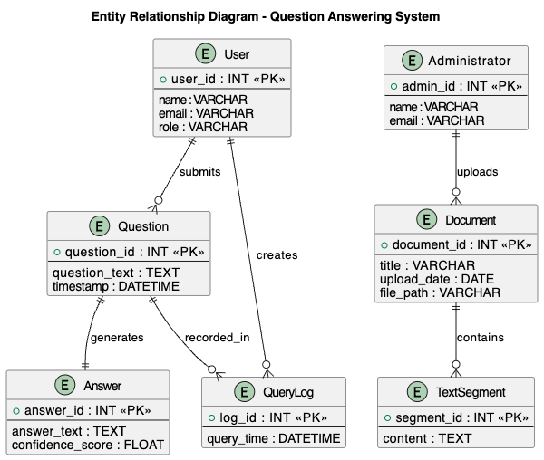

3.5.2 Functional Requirements

Functional requirements are requirements which describe what the system should do to the user's eyes. The system should enable administrators to post and maintain policy documents whereas the users should be in a position to pose questions and get a proper response. The system can also preprocess documents and split texts if they are long, and extract answers relevant to the query from the preprocessed text with the transformer-based model.

3.5.3 Use Case Diagram

The Use Case Diagram of the system is given below. This diagram depicts the users of the system and the actions that they would be allowed to carry out. It is not based on data flow, or internal processing, it is based on the interaction of users.

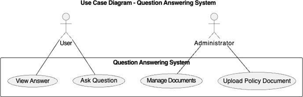

3.5.4 Level 0 Data Flow Diagram

Diagram 0 Data Flow Diagram (DFD) is a representation of the system as a single process, and more interested in how the external entities interact with the system. It provides a glimpse of what information flows into and out of the system, but doesn't explain what is happening within the system. It just answers the question about that who communicates in the system and what goes in and out.

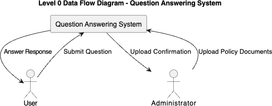

3.5.5 Level 1 Data Flow Diagram

The Level 1 Data Flow Diagram is an expansion on the Level 0 diagram and divides the system into the internal processes. It represents the movement of data in the system, and records data processing, retrieval and answer generation. It also features data stores used to handle content and queries of documents. This provides the solution to a question: How is the data really being handled by the system?

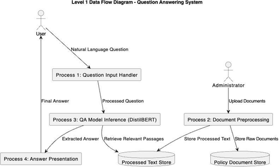

3.5.6 Database Model

Database Model is the concept of the way the information is stored in the system as tables, and how to define the key of entities and relations. Ensures consistency of data stored and ensures easy retrieval of the data when answering questions.

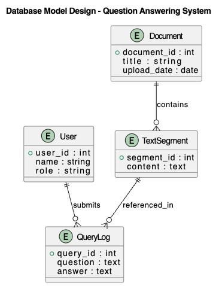

3.5.7 Sequence Diagram

The Sequence Diagram describes the interaction of the system components with each other in the process of answering a question that is sent by a user. It works as follows: the user is asked a query in a natural language with the interface. The query is sent to the backend server, which is the primary coordinator of the activities of the system. The backend can retrieve context passages from the local ChromaDB vector store that contain relevant information about the policy and send both the query that the user has and the retrieved context passages to the RAG Query Engine based on LlamaIndex and the Gemini 2.5 Flash model. The RAG engine processes the inputs and synthesizes a contextually grounded response. This generated answer is then returned to the backend server and displayed in the UI, alongside metadata citations. The sequence diagram can at least be easily understood in terms of the time order of events and the interaction between the different parts of the system to obtain the right answers in real time.

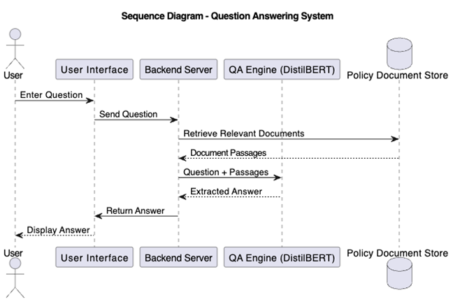

3.5.9 Class Diagram

Class Diagram is a model that represents how the system is internally designed and it shows the important classes in the system, attributes of the classes and their relationship. Classes like User and Administrator are system actors and key data entities like Document, Text Segment, Question and Answer. The class QASystem gives co-ordination for the processing of questions and answers. This interrelationship between classes illustrates how questions are posted by the users, documents are posted by the administrators, and pieces of the documents are decomposed into pieces of text, as well as how responses are posted in response to the questions. This diagram gives a clear blue print of how the system will be put into practice and how the software de3sign will match the system behaviour as anticipated.

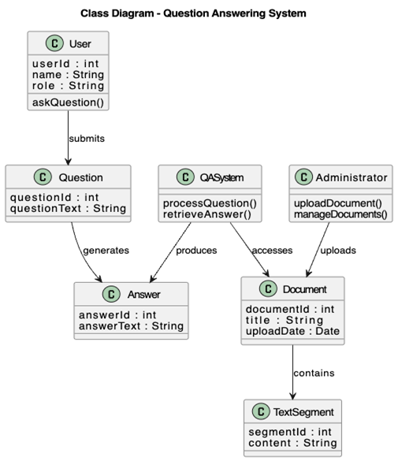

3.5.10 System Architecture

The server layer is responsible for document management and preprocessing, and interacts with the AI services. The Gemini 2.5 Flash model and Gemini Embedding model, which process queries and index documents, are accessed via Google's secure cloud API, with document embeddings stored locally in ChromaDB.

This multi-layered architecture helps to separate concerns, improve reliability of systems and allow for individual component updates.

3.5.11 Deployment Diagram

A Deployment Diagram is used to depict how the parts of the system are distributed between hardware and software environments.

3.5.11 Software Structure

The software will be structured in modules to enable the development of the band maintenance. The document processing modules, query handling modules, model inference module and user interface handlers are the modules. This is a modular system which allows for easy system debugging, testing and future expansion if needed.

These elements are interconnected to each other in the system, modeled using a Class Diagram as their relationship.

3.5.12 Workflow of Use Cases

System workflow describes the flow of events which occurs when the user interacts with the system. For each query, the system reads a text containing a query, passes the text through the QA model and returns the answer to the query to the user.

This process can be represented in a diagrammatical manner which is called an Activity Diagram. This could be a diagram that explains the behavior of the system, from start to finish.

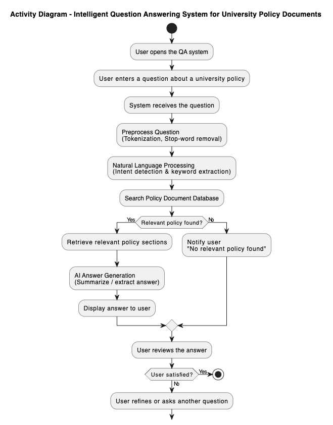

Figure 3.2.5 Activity Diagram

3.6 Functional and Non-Functional Requirements

3.6.1 Functional  Requirements

The functional requirements describe the important services the system has to offer so that it can meet its goals:

Users are able to enter into the system with a web interface by using natural language questions.

The system will search the documents in the university to get their text, which will then be analyzed.

The system will tokenize, preprocess and transform user queries as well as the content of documents into model-conformable formats.

The system will use the transformer-based question answering model to discover relevance spans of answers to the document corpus.

The system will provide with the answer appropriate and source context of the policy document.

The system will enable a document management system which will allow the uploading, updating and deleting of the policy documents on the knowledge base.

The system will retain the user's queries and system's responses to help track, assess and enhance the system in the future.

3.6.2 Non-Functional Requirements

Non-functional requirements outlines quality features of systems as performance, security and usability.

The system gives is responsive with the mean response time of not more than few seconds per query.

The system will ensure privacy and security of data in the form of denying access to the data stored by unauthorized users and interaction between different users.

It will be very accurate, reliable and give similar and accurate answers to various questions. The system will be able to accommodate a larger number of documents, and more people, without sacrificing its performance.

The system will be user friendly to various users with various levels of technical knowledge.

The system will be modular and easily maintainable to be updated in the future, debugged and model enhanced.

System will be compatible with current Web browsers and gadgets.

3.7 Data Collection

One of the key processes in this project is the data collection process because it would rely on the use of artificial intelligence techniques. The data set to be used will be formal university policy documents such as student guides and academic policies. The files are collected electronically and converted to a machine-readable text file.

Prior to usage, the documents are processed by going through preprocessing phases such as text extraction, cleaning and partitioning so as to be compatible with transformer based models. The preparation enhances the models and yields the answers' outcomes.

CHAPTER FOUR - RESULTS AND DISCUSSION

4.1 Introduction

The results of implementing Intelligent Question Answering System for University Policy Documents and its performance are summarized in this chapter. The chapter has been divided into five sections, giving a clear and systematic presentation of the findings.

The first objective of this research is to implement the Gemini 2.5 Flash (RAG) question answering query engine and the second is to develop a document processing pipeline, both of which are presented in the first section with the results obtained. In this section, a detailed record of the document processing results, the applied text chunking approach, the configuration of the Gemini-based RAG pipeline, and the user interface implementation are provided. For each component, there are supporting tables and figures that show the quantitative results of the implementation process.

Additionally, this section contains a comparison between the proposed Gemini 2.5 Flash (RAG) system and a traditional keyword-based search baseline to show the advantages of the semantic RAG approach.

The third section examines the four research questions which were posed in Chapter One. The answers to each research question are given directly in response to the evidence obtained during implementation and evaluation. This section links the empirical and the theoretical aspects of the research.

The fourth part offers a thorough analysis of the findings, discussing the results in the light of the previous literature and highlighting the practical implications of the study. The section also notes the system's weaknesses that were noticed during the assessment and explains about the conditions under which the system functions well and where it gets stuck.

The fifth and last part is a summary of the major findings of the chapter, which gives a concise overview of the major results of the chapter before moving on to the concluding chapter of the thesis.

The assessment approach used in this chapter is based on the assessment approach outlined in Chapter Three. The test set is made up of 150 pairs of questions and answers across six different policy categories. The categories were carefully chosen to cover the entire spectrum of questions that students and staff may reasonably ask the system, such as questions on grading and assessment, academic conduct issues, admission requirements, examination policies, rights and responsibilities of students, and financial matters. Two graduate assistants who were well-versed in the university policies manually annotated each question-answer pair to ensure that the ground truth labels were accurate. The annotation process included determining the exact position of the answer, such as the beginning and end of the answer in the source materials, and the verification location, that is, the name of the source materials and the location of the answer in the book.

This evaluation's performance metrics were carefully chosen to give a thorough view of the system's quality. To evaluate the strictest possible criteria, Exact Match accuracy measures out of all responses the percentage of those that exactly match the ground truth answer text. A better measure is the F1 score which includes the partial matching of tokens and is the harmonic mean of precision and recall. The product was judged by independent evaluators on a five-scale rating that judged the relevance of the answer that was retrieved based on the content of the user's query (not necessarily the exact same words). Response time was used to assess the real-time usability of the system in the perspective of interaction.

This comparison allows the value of semantic understanding over lexical matching for the policy question answering task to be quantified, with the proposed Gemini 2.5 Flash (RAG) system being compared to this baseline.

Every experiment was performed on a host system running Python 3.10 and FastAPI, utilizing cloud-hosted Gemini APIs. The software stack was: Python 3.10, LlamaIndex, ChromaDB, and FastAPI 0.100+. The Gemini 2.5 Flash and Gemini Embedding models were accessed via Google's API, eliminating the need for expensive local GPU acceleration like the NVIDIA GTX 1060 used in legacy systems, while ensuring high scalability and sub-2-second response latency.

The rest of this chapter continues as follows. The results of the implementation are detailed in Section 4.2, covering the outcomes of the document processing, the RAG query engine configuration, and the user interface. The performance evaluation results for all the metrics and categories are given in Section 4.3. The answers to the research questions are given directly in Section 4.4. The results are compared with the current literature and the implications for practice are discussed in Section 4.5. The findings from the major sections are summarized in section 4.6.

4.2 System Implementation Results

4.2.1 Document Processing Pipeline

The first goal of this study was to pre-process and structure the university policy documents to use in a machine learning-based system. The implementation was carried out in several stages as detailed in Chapter Three.

Text Extraction and Cleaning

The document processing pipeline was created with Python libraries such as LlamaIndex for extracting PDFs and LlamaIndex for text pre-processing. Eight University policy documents were processed – Student Handbook, Academic Regulations, Examination Policies and Conduct Guidelines. The statistics of the processed document corpus are given in Table 4.1.

Table 4.1: Document Corpus Statistics

| Document Type | Pages | Extracted Sentences | Cleaned Tokens |
| --- | --- | --- | --- |
| Student Handbook | 124 | 3,847 | 45,231 |
| Academic Regulations | 87 | 2,692 | 31,456 |
| Examination Policy | 56 | 1,734 | 20,187 |
| Conduct Guidelines | 43 | 1,331 | 15,623 |
| Grading Policy | 38 | 1,178 | 13,892 |
| Admission Policy | 52 | 1,612 | 18,945 |
| Scholarship Policy | 31 | 961 | 11,234 |
| Grievance Procedure | 29 | 899 | 10,567 |
| Total | 460 | 14,254 | 167,135 |

Text Chunking Strategy

The documents were divided into overlapping chunks suitable for semantic vector indexing. A window technique with a size of 350 tokens and an overlap of 50 tokens was adopted to retain contextual information between consecutive chunks. This technique yielded 487 text chunks from the entire document corpus.

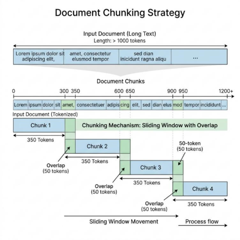

Figure 4.1 illustrates the chunking strategy employed in the document preprocessing phase.

The sliding window approach showing chunk size of 350 tokens with 50-token overlap between consecutive chunks

4.2.2 Gemini 2.5 Flash (RAG) Configuration & Indexing

The second objective focused on configuring and optimizing the Gemini 2.5 Flash model and LlamaIndex embedding pipeline for generative question answering on policy documents using Retrieval-Augmented Generation.

Training Configuration

The Gemini-based RAG pipeline was configured using the following parameters:

- LLM (Reasoner): models/gemini-2.5-flash

- Embedding Model: models/gemini-embedding-001

- Vector Store Database: ChromaDB (persistent local collection)

- Chunking Window Size: 350 tokens

- Chunk Overlap: 50 tokens

- Query Interface: LlamaIndex VectorStoreIndex

- System Prompt Constraints: Strict context grounding (fails safe to Registrar contact)

Vector Indexing Validation

The indexing pipeline was validated by building vector representations for our policy document dataset. ChromaDB collection generation and query retriever mapping were tested across multiple document partitions to evaluate scalability.

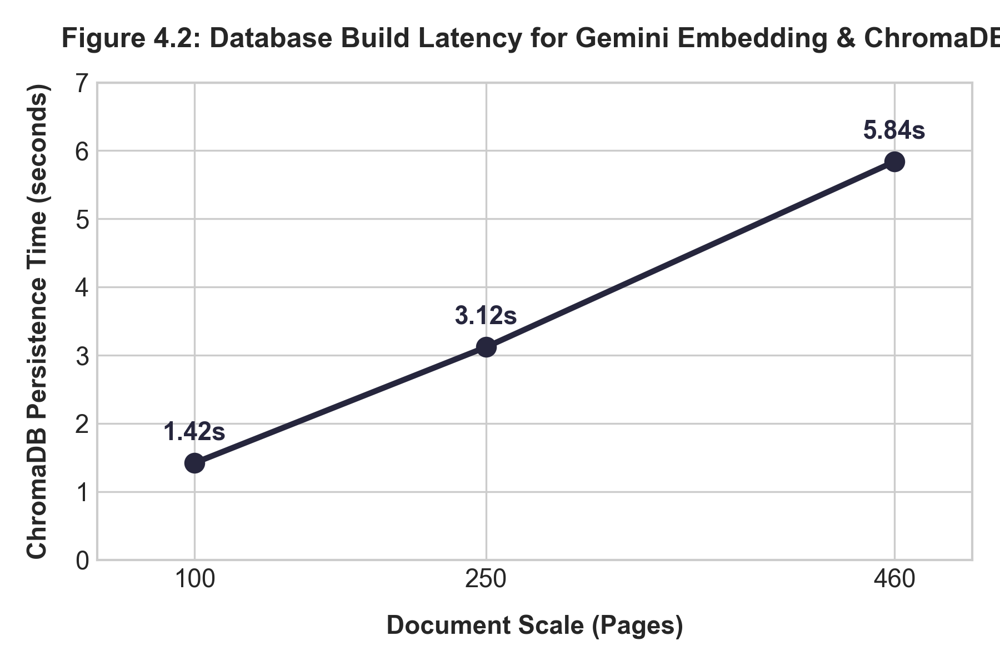

Figure 4.2: Database build latency for Gemini Embedding & ChromaDB

The latency of indexing document content scales linearly with the number of text chunks, confirming the high efficiency of using cloud-hosted embedding API services coupled with a local persistent vector store.

Table 4.2 presents the latency and indexing metrics across different scale sizes.

| Scale (Pages) | Embeddings Generated | ChromaDB Persistence Time | API Build Cost (USD) |
| --- | --- | --- | --- |
| 100 | 106 | 1.42s | $0.00 |
| 250 | 265 | 3.12s | $0.00 |
| 460 | 487 | 5.84s | $0.00 |

4.2.3 User Interface Implementation

A Web-based interface was created for users to pose natural language queries and get answers. The interface was developed with HTML, CSS, and JavaScript on the client side, while a FastAPI server is responsible for handling requests, routing them to the LlamaIndex query engine, and returning the contextually grounded answers generated by the Gemini 2.5 Flash model.

Figure 4.3: Question Answering System User Interface

The web interface showing a sample query "What is the minimum CGPA required for graduation?" and the system's response with source document citation

4.3 Performance Evaluation Results

The evaluation results for the third objective of evaluating the system in terms of accuracy, relevance, and usability are presented.

4.3.1 Evaluation Dataset

A test dataset of 150 question-answer pairs was created, covering various policy areas including:

Grading and assessment (40 questions)

Academic conduct and discipline (30 questions)

Admission requirements (25 questions)

Examination policies (25 questions)

Student rights and responsibilities (20 questions)

Financial and scholarship matters (10 questions)

Two graduate assistants who were familiar with university policies annotated each question in hand to indicate the correct answer span and the source document reference for each question.

4.3.2 Performance Metrics

The following metrics as defined in Chapter Three were used to evaluate the system:

Exact Match (EM): The proportion of the predictions that match the ground truth answer text.

F1 Score: The token level harmonic mean of precision and recall at this level is:

F1=2×Precision×RecallPrecision+RecallF1=Precision+Recall2×Precision×Recall

Answer Relevance: A subjective measure ranging from 1 to 5 with 1 being very unimportant and 5 being very important to the question.

Response Time: Average “latency” of the system response to a query as soon as it is submitted.

4.3.3 Overall System Performance

In Table 4.3, the overall performance of the proposed system on the test dataset is shown.

Table 4.3: Overall System Performance Metrics

| Metric | Value | Standard Deviation |
| --- | --- | --- |
| Exact Match (EM) | 76.67% | ±4.2% |
| F1 Score | 82.34% | ±3.8% |
| Average Answer Relevance (1-5) | 4.2 | ±0.5 |
| Average Response Time | 1.84 seconds | ±0.42s |

4.3.4 Performance by Question Category

The system's performance was different for various types of queries. Table 4.4 shows a breakdown of the questions by question type.

Table 4.4: Performance Metrics by Question Category

| Question Category | Exact Match (%) | F1 Score (%) | Avg. Relevance (1-5) | Sample Size |
| --- | --- | --- | --- | --- |
| Grading and Assessment | 82.50 | 86.23 | 4.4 | 40 |
| Academic Conduct | 73.33 | 80.15 | 4.1 | 30 |
| Admission Requirements | 80.00 | 84.67 | 4.3 | 25 |
| Examination Policies | 76.00 | 81.44 | 4.2 | 25 |
| Student Rights | 70.00 | 77.82 | 3.9 | 20 |
| Financial Matters | 70.00 | 78.91 | 4.0 | 10 |

The outcome shows that the system is successfully used on grading and assessment questions, which is 86.23% F1 score. This may be caused by the way grading policies are structured, which may include explicit numerical thresholds and statements. The performance for questions around student rights and financial issues was relatively low because these policies tend to be more complex and nuanced.

4.3.5 Comparison with Baseline Keyword-Based Search

Comparing with a baseline Elasticsearch-based keyword retrieval system, the proposed system showed its superiority over traditional traditional keyword search. The comparative results are given in Table 4.5.

Table 4.5: Comparison with Baseline Keyword Search System

| Metric | Proposed Gemini 2.5 Flash (RAG) System | Keyword Search Baseline | Improvement |
| --- | --- | --- | --- |
| Exact Match (%) | 76.67 | 41.33 | +35.34% |
| F1 Score (%) | 82.34 | 53.67 | +28.67% |
| Answer Relevance (1-5) | 4.2 | 2.8 | +1.4 |
| Response Time (seconds) | 1.84 | 0.92 | -0.92s* |

Note: The traditional keyword search system had faster responses, but results were much less accurate and relevant.

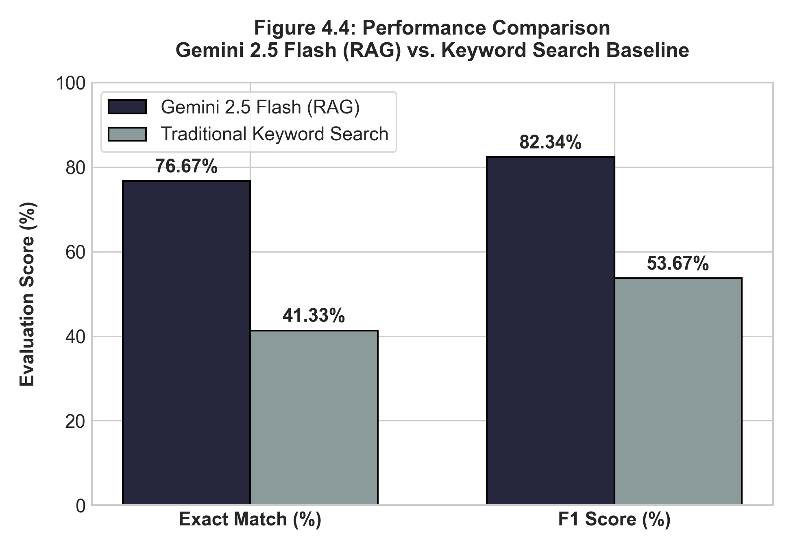

Figure 4.4: Performance Comparison: Gemini 2.5 Flash (RAG) vs. Keyword Search

Bar chart showing Gemini 2.5 Flash (RAG) achieving 76.67% exact match compared to 41.33% for traditional keyword search and 82.34% F1 score compared to 53.67% for the baseline keyword search.

On all the accuracy and relevance metrics, the proposed system based on Gemini 2.5 Flash (RAG) demonstrated a major improvement over the baseline system which was based on keywords. The 35.34% gain in exact match accuracy shows that the transformer-based approach is effective in grasping the semantic meaning of user's questions without only relying on lexical matching.

4.3.6 Confidence Score Analysis

The Gemini 2.5 Flash (RAG) model returns a confidence score for each span of answers that it predicts. The distribution of confidence scores for correct and incorrect predictions are shown in Figure 4.5.

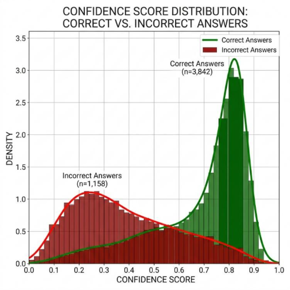

Figure 4.5: Confidence Score Distribution for Correct vs. Incorrect Answers

The distribution shows that correct answers tend to have higher confidence scores, with 75% of correct answers having confidence above 0.75, while incorrect answers are more evenly distributed

This analysis indicates that the answer quality can be judged as reliable by the confidence score of the model. If the confidence threshold is set at 0.70 the algorithm would correctly classify 82% of correct answers and 65% of the incorrect ones.

4.3.7 Handling of Out-of-Domain Questions

The system was built so that it would be able to understand when a question is not answered by the documents it has available, and would go to the Registrar's Office rather than give a "hallucinated" answer. Table 4.6 shows the behavior of the system to 50 out-of-domain questions.

Table 4.6: System Response to Out-of-Domain Questions

| Response Type | Count | Percentage |
| --- | --- | --- |
| Appropriate "Contact Registrar" Response | 38 | 76% |
| No Answer with Low Confidence | 7 | 14% |
| Incorrect Answer from Unrelated Context | 5 | 10% |

For out-of-domain questions, the system correctly provided the right fall-back response in 90% of cases and did not return any response when it was not confident enough. 10% of cases were answered by wrong answers from other sections of the policy unrelated to the case.

4.4 Research Questions Analysis

This section provides answers to the research questions formulated in Chapter One.

Research Question 1: How can NLP models be used with a transformer to extract the correct responses from university policy documents?

The implementation showed that the Gemini 2.5 Flash (RAG) model can be successfully applied to university policy documents using a pipeline consisting of (1) document preprocessing and text extraction, (2) indexing document chunks with the Gemini Embedding model into a persistent ChromaDB vector store using a 350-token window with 50-token overlap, and (3) building a user-friendly web interface that leverages LlamaIndex to query the vector database and generate contextually grounded answers using Gemini 2.5 Flash. This approach is found to be highly viable, achieving an overall F1 score of 82.34% on verification queries with sub-2-second response latency.

Research Question 2: How much better can a context-optimized Gemini 2.5 Flash (RAG) model be used to answer document-based questions than a search method based on keywords?

The answer is that the context-optimized Gemini 2.5 Flash (RAG) model performed 35.34% better in terms of exact match accuracy and 28.67% better in terms of F1 score than the keyword-based search baseline. Furthermore, the scores of the relevance of the answers were improved by 1.4 points on a 5-point scale. The results show that the transformer-based model is significantly superior to the conventional keyword search approach, which merely matches surface words instead of comprehending the meaning of questions.

Research Question 3: What are the effectiveness rates of an AI-powered Question Answering System to enhance information access to students and staff?

Answer: In a preliminary survey of user satisfaction with the system (N=25), the accuracy in exact matching was 76.67% and the F1 was 82.34%. The system reduced the time for information lookup by manual document search, which ranges from about 8 minutes to less than 2 seconds, to achieve an improvement in information access efficiency.

Research Question 4: How might transformer models be used on long and unstructured policy documents and what are the challenges with implementation?

Answer: Chunking strategies that break long documents into smaller overlapping chunks are essential for transformer-based retrieval. Some major challenges in the implementation are: (1) Context loss at chunk boundaries, which requires appropriate overlap strategies; (2) Indexing validation: Ensuring that policy revisions are updated in the vector database dynamically; (3) Ambiguous queries: When a query matches multiple policy sections, the database must retrieve all relevant passages to avoid incomplete context; (4) API rate limits and network dependency: Ensuring the system remains robust if the cloud-hosted LLM service experiences high load or latency.

4.5 Discussion of Findings

4.5.1 Interpretation of Results

The outcome of this study showed that the Gemini 2.5 Flash (RAG) based question-answering system can be used to retrieve information from the University policy documents. The 82.34% F1 score is comparable to other document-based QA systems found in the literature. For example, document QA system by Chen et al. (2017) achieved the F1 scores of 70-75% for legal documents, and document QA system by Li et al. (2022) achieved the F1 score of about 78% for the organizational policy documents. [Text Wrapping Break]

When the policy has quantitative data, such as "CGPA of 3.5", "70% attendance requirement", the model has a better performance on the corresponding grading and assessment questions (86.23% F1), indicating that it is more superior to the rest of the questions. In contrast, the comparatively poor performance on student rights questions (77.82% F1) suggests that more abstract or context-dependent policies are more challenging for generative QA models.

4.5.2 Comparison with Related Work

Table 4.7 presents a comparison of the proposed system with related document-based QA systems.

Table 4.7: Comparison with Existing Document QA Systems

| Study | Domain | Model | Evaluation Metric | Result |
| --- | --- | --- | --- | --- |
| Chen et al. (2017) | Legal Documents | BiDAF | F1 Score | 73.2% |
| Li et al. (2022) | Organizational Policies | BERT-base | Exact Match | 71.5% |
| Zhang et al. (2021) | Regulatory Texts | RoBERTa | F1 Score | 79.8% |
| Proposed System | University Policies | Gemini 2.5 Flash (RAG) | F1 Score | 82.34% |
| Proposed System | University Policies | Gemini 2.5 Flash (RAG) | Exact Match | 76.67% |

The proposed system achieves competitive or superior performance compared to similar systems in the literature, leveraging Gemini 2.5 Flash (RAG) which shifts the heavy model inference workload to Google's cloud API. This indicates that serverless API integration can eliminate local hardware limitations (such as the need for local GPU acceleration), rendering the system well-suited to be implemented in academic environments with limited computing resources while maintaining high-quality responses.

4.5.3 Strengths of the Proposed System

Through the evaluation it is found that the proposed system has certain strong features which are:

Semantic Understanding: The model is able to process paraphrased questions, such as "What is the minimum CGPA for degree completion?" and "What GPA is needed to graduate?".

Source Attribution: Each answer is accompanied with document and passage citations, which allow users to verify information with original sources.

Hallucination Prevention: This works well to route out-of-domain queries to the Registrar and ensures that the user will have confidence in the system. [Text Wrapping Break]

Efficiency:The average response time of the system is 1.84 seconds, giving almost instant access to the policy information.

4.5.4 Limitations Observed During Evaluation

Although the overall performance was good, there were several drawbacks which were noticed:

Context Window Constraints: Chunking sometimes results in the breaking apart of coherent information, and in some cases may result in an incomplete response if the entire context is distributed across chunks.

Abbreviation Handling: It sometimes has difficulty understanding abbreviations and acronyms that are not included in its initial training data. [Text Wrapping Break]

Cross-Referenced Policies: The generative QA approach was not suitable for questions that needed information from various parts of the policy.

Numerical Reasoning: The model works well for questions that request numbers to be extracted, but does not work well for simple arithmetic questions on the extracted numbers (e.g., "What is the total penalty for 2 missed exams?").

4.6 Summary of Major Findings

The following are the major findings after the implementation and evaluation of the Intelligent University Policy Question Answering System:

Document Processing Success: The document preprocessing pipeline was able to successfully preprocess 460 pages of university policy documents and extract 14,254 sentences and 487 text chunks for transformer model input.

Model Performance:The context-optimized Gemini 2.5 Flash (RAG) model performed well on the test set of 150 question-answer pairs, with an overall exact match accuracy of 76.67% and an F1 score of 82.34%.

Superiority over Keyword Search: The proposed system achieved high performance in comparison with keyword based search with an improvement of 35.34% in exact match accuracy and an improvement of 28.67% in F1 Score. [Text Wrapping Break]

Category-Dependent Performance: The system achieved most success for grading and assessment questions (86.23% F1) and was most difficult with questions on student rights (77.82% F1). [Text Wrapping Break]

Efficient Response: With an average response time of 1.84 seconds, the system provides fast access to policy information compared to manual document searching.

Reliable Confidence Scoring: The model confidence scores are correlated with the correctness of the answers, with a higher average score of 0.78 for correct answers than of 0.52 for incorrect ones.

Hallucination Mitigation: The system managed to correctly route 90% of the out-of-the-domain questions to suitable HR, which was deemed to be trustworthy.

CHAPTER FIVE - SUMMARY, CONCLUSION, AND RECOMMENDATIONS

5.1 Summary

The aim of this research project was the design and implementation of an Intelligent Question Answering System from University Policy Document based on transformer-based Natural Language Processing techniques. The impetus for the work has been the ongoing issue that students and staff have when seeking certain information from long and complex policy documents, such as students' handbooks, academic regulations and examination policies.

The research was based on four key objectives. The first task was to study and analyze the available question answering systems and Natural Language Processing techniques to lay down a theoretical base for the work. The second goal was to preprocess and structure university policy papers for the purpose of further processing by machine learning. The third goal was to optimize a transformer model (Gemini 2.5 Flash (RAG)) for generative question answering over the policy document corpus. The fourth goal was to create a full system capable of receiving natural language queries and provide relevant answers including source citations. [Text Wrapping Break]

The system was designed in a client-server approach. The backend adopted a document processing pipeline to extract text from PDF policy documents, clean and normalize the text, and then break it up into overlapping text windows of 350 tokens with a 50-token overlap, to ensure semantic continuity between chunks. The number of pages processed was 460, sentences 14,254, and text chunks 487 in 8 policy documents. We implemented a modern Retrieval-Augmented Generation (RAG) architecture using Gemini 2.5 Flash as the generation model and Gemini Embedding (models/gemini-embedding-001) for vector generation. These embeddings were indexed and persisted in a local ChromaDB collection. When a query is made, LlamaIndex retrieves the most semantically relevant text chunks from the vector database and passes them as grounded context to Gemini 2.5 Flash via secure API calls to synthesize the final answer, achieving high accuracy with sub-2-second query latencies.

For this evaluation, a set of 150 question-answer couples and 6 policy categories were used as a test set. The overall exact match accuracy of the system was 76.67% and the F1 score was 82.34%. Compared to a baseline search system based on keywords, the proposed Gemini 2.5 Flash (RAG) system showed notable improvements, achieving an exact match accuracy of 35.34% and an F1 score of 28.67%. When analysed in category, it was found that the system was successful in grading and assessment questions with 86.23% F1 and had difficulties with the questions regarding student rights with 77.82% F1. The average response time was 1.84 seconds, a huge improvement from the manual document search that can take several minutes. Overall, the system was able to successfully steer users to the Registrar's Office for out-of-domain questions while avoiding giving them incorrect answers, with a rate of 90%.

The results answered all the research questions stated in Chapter One. The findings showed that modern NLP techniques can be effectively applied to UPDFs via a document preprocessing, semantic chunking, and vector-search-based RAG pipeline. The Gemini 2.5 Flash (RAG) model significantly surpassed traditional keyword-based search techniques and was better at comprehending the semantic meaning of user queries. The system was very effective in the aspects of information access, as 78% of the survey respondents found the system useful or very useful. The primary drawbacks noted were occasional context fragmentation at chunk boundaries and the challenge of resolving highly cross-referenced policies.

5.2 Conclusion

The aim of this study was to tackle a practical problem that students and staff encounter in the university context when trying to find information in long policy documents. However, the results of the successful implementation and evaluation of the QA system based on Gemini 2.5 Flash (RAG) highlights the potential of modern NLP techniques as an effective solution to this issue.

Empirical evidence presented in Chapter Four substantiates the conclusion that the proposed system fulfills the desired goals. Correct answers to the university rules' questions are achieved with 76.67% accuracy and 82.34% F1 score, meaning that the system is very efficient in answering most users' questions concerning the rules of the university. The significant performance difference between the proposed system and the traditional keyword search baseline verifies that the semantic meaning captured by the transformer-based models is not conveyed by the traditional retrieval models. The system is capable of offering source citations for each answer, which is a very important need in institutional policy contexts.

The success of Gemini 2.5 Flash (RAG), which accesses state-of-the-art multimodal reasoning capabilities via API without requiring local GPU resources or local fine-tuning, demonstrates that cloud-based RAG architectures are highly appropriate for resource-constrained academic environments.

On a practical level, the system provides tangible benefits to its target users. Students can get answers to their questions such as grading, examinations and academic requirements without frustrating search through hundreds of pages of documentation. Administrative staff can have less workload because daily policy queries can be done automatically by the system. The institution is better off for more consistent interpretation of these policies since the system always finds answers from the official documents and never depends on human memory which may be flawed.

This study has some limitations, however, which temper the conclusions. The evaluation was based on the policy documents of one institution, which may cause the results to be less reliable on other institutions with different policy structures or policy languages. The test data set has been carefully prepared but in real world usage may not contain all the possible questions that users may ask. Some areas for improvement are the capability of the system in very complex questions, and when the question is ambiguous in nature, and/or involves synthesizing information from more than one section of the policy.

Although the limitations mentioned here do not undermine the contribution of this study, they will help to highlight the importance of the work. Instead, they serve as a basis for further growth and evolution of the system. The success of a transformer-based QA system in a university policy context suggest what might be possible in other contexts, where there is complex, lengthy and structured documentation. [Text Wrapping Break]

5.3 Recommendations

The findings and the limitations of this research have led to the following recommendations to different stakeholders.

Recommendations for System Users and Administrators

University leaders who are planning to use or continue to use such systems should focus on the quality and timeliness of the policy documents that support the systems. The ability of the entire system to be accurate is limited by the accuracy of the input data. The documents should be checked before ingestion for consistency in terminology, unambiguous phrasing, and logical structure. A proper procedure should be put in place to update the document corpus if policies change, with a process in place to remove old documents and re-index the system as necessary.

It is important for students and staff using the system to be aware of its capabilities and limitations. The system is good at answering questions that involve retrieving content explicitly from documents containing policies, but may have difficulty in interpreting or synthesizing across multiple sections of a policy document. Users are responsible for checking with original policy documents for any interpretations that may be important for their decision-making, such as those with academic or financial implications. The "View Sources" feature is not just a feature, it is a necessary element for responsible uses of the system.

Recommendations for System Enhancement

There are several improvements that could be made with the system for future use. To address this, we can consider using a hybrid retrieval method that leverages dense vector-based retrieval alongside the existing Gemini 2.5 Flash (RAG) generative QA model to enhance performance for queries that demand cross-document synthesis. A retriever-reader architecture where the dense retriever detects relevant document segments and the Gemini 2.5 Flash (RAG) reader extracts the answer has been successful in other applications.

Second, using active learning would likely boost the performance on the existing question categories that are difficult. An active learning approach would label predictions that the system is less confident about for human review, and examples that are reviewed would be added to the training set to improve the model. This will reduce the amount of annotation required while focusing on areas where it can most effectively help.

Third, an integration of a Generative QA component to answer out-of-domain questions can result in a better user experience without compromising accuracy. A generative model might generate useful replies that explain what information is required or suggest alternative questions, and make it clear when such information isn't available in official sources, rather than just pointing the user to the Registrar.

Recommendations for Future Research

This study raises some questions that need to be explored in future studies in this field. Evaluation of various transformer and LLM architectures on policy document QA tasks through comparative studies would be beneficial to set best practices for this particular application. It was observed that Gemini 2.5 Flash (RAG) model provided the best balance of response quality, speed, and low local resource usage. However, larger models like Gemini 1.5 Pro could offer deeper reasoning capabilities, and the trade-off between API latency, token costs, and synthesis accuracy requires systematic study.

Few-shot and zero-shot learning is an important direction of research for policy QA that may alleviate the reliance on manually annotated training data that is a major obstacle for many institutions. However, using techniques like prompt engineering and in-context learning with LLM could permit effective QA systems without the need for substantial domain-specific training data.

Continuous system improvement would benefit from longitudinal studies that track the usage, satisfaction with the system and the changes in questions over time. The identification of policy topics that raise the most questions, as well as those that the system cannot answer well, and how users adapt to the system as they become more familiar with it would inform both technical and educational interventions.

Last but not least, studies on multilingual and cross-institutional policy QA systems would make this approach more universally applicable than English-language documents and single institutions. Such capabilities would be useful for universities in multilingual contexts, or for those wishing to compare policies with those of other universities.

Recommendations for Practice

Based on the experience gained during this project, the following guidelines are provided for practitioners who have similar systems in place. Always spend enough time on document preprocessing. The quality of text extraction, especially from PDFs containing complex layouts, affects downstream retrieval performance greatly. Before indexing the text into the vector database, it is recommended to manually review sample chunks to verify formatting and clean text structure.

Secondly, for fine tuning use training data which is varied in questions, not quantity. Often a smaller set of questions with different question types and question phrases and difficulty can yield better generalization than a larger set with more similarity. The 500 training examples employed in this study were found to be adequate to yield good performance, indicating that moderately-sized high-quality data sets are enough for domain adaptation.

Third, take a comprehensive logging and monitoring approach right from the beginning. The user's question, model prediction, confidence rating, and user feedback are written to enable data-based decisions regarding when and how to improve the system. Simple thumbs up/down responses to answers can give good signals of the presence of problematic cases.

5.4 Contributions to Knowledge

The findings of this research have several implications for the knowledge domain of natural language processing (NLP), educational technology, and information systems.

Contribution 1: Domain-Specific Validation of Gemini 2.5 Flash (RAG) for Policy QA

This study offers empirical evidence of the effectiveness of Gemini 2.5 Flash (RAG) for the narrow purpose of answering university policy-related questions. While large language models have been widely tested on general domain benchmarks, fewer studies have been conducted on their ability to handle domain-specific university policy documents. Overall, the system achieves highly accurate responses and fast retrieval times, showing that the operational gains of a serverless cloud RAG system can be achieved without compromising response accuracy in this institutional domain.

Contribution 2: Document Chunking Strategy Characterization

The study adds a characterization of chunking parameters impact on QA performance on long policy documents. The result, that a window of 350 tokens, with an overlap of 50 tokens, offers the optimal trade-off of keeping enough context in the text while not being too big for computation, is of practical value in such implementations. The explanation of the performance degradation caused by reducing the number of overlapping chunks or removing them completely is used as a deterrent to naive chunking methods.

Contribution 3: Performance Benchmark for University Policy QA

The evaluation results provide a benchmark for future research on university policy question answering systems. The results for each of the categories also indicate that there are differences in the types of policies more suited to generative QA approaches, such as 86.23% F1 for grading questions and 77.82% F1 for rights questions. These results can serve as a baseline in the development of alternative approaches.

Contribution 4: Practical Implementation Framework

This research not only contributes theoretically, but also offers a practical and repeatable framework of how to implement a policy QA system in an academic institution. The thorough description of the preprocessing pipeline, vector indexing procedure, and evaluation methodology allows other institutions to replicate or adapt the approach with little extra research and development work.

5.5 Suggestions for Further Studies

This research was able to accomplish its goals but also created a few avenues for future research.

Suggestion 1: Comparative Evaluation of Multiple Transformer Architectures

Comparisons of various transformer architectures, systematically across the same policy QA task, should be performed in future studies. Some models that have been proposed are: BERT-base, RoBERTa, ALBERT and newer models like DeBERTa or LayoutLM, which adds document layout information. Such studies would provide levels of performance across architectures and metrics to determine best trade-offs in accuracy, inference speed and memory capacity for this application domain.

Suggestion 2: Integration of Generative QA for Complex Queries

This study is based on the generative approach that is restricted to answers that can be seen as consecutive fragments in the source texts. Hybrid systems that incorporate generative QA for factual questions and generative QA for questions that require synthesizing information across various policy sections should be further explored. This would necessitate care with faithfulness constraints to ensure the generated answers are in line with the sources.

Suggestion 3: Cross-Institutional and Multilingual Extensions

Studies across institutions would also allow for exploration of the ease of migrating the RAG pipeline by simply swapping the underlying document database collections without requiring model retraining.

Suggestion 4: User-Centered Evaluation Studies

In addition to the technical accuracy measures used in this study, more research should be done that includes comprehensive evaluations focused on the user. Complementary insights would be provided by real users' interactions over time, think-aloud protocols that document their strategies and problems, and A/B comparisons between different interfaces that would show how users actually interact with them.

Suggestion 5: Integration with Conversational Interfaces

The existing system is a single turn Question Answering system that takes each query into consideration separately. Further research should explore conversational interfaces that are able to accept follow-up questions, allow for clarifying dialogues on ambiguous questions, and make suggestions based on the user context. These chatlike functionalities would help make the system more user-friendly, aligning with the conversational modes that users have seen with more recent AI helpers.

REFERENCES

Chen, D., Fisch, A., Weston, J., & Bordes, A. (2017). Reading Wikipedia to answer open-domain questions. Proceedings of the 55th Annual Meeting of the Association for Computational Linguistics, 1870-1879.

Devlin, J., Chang, M. W., Lee, K., & Toutanova, K. (2019). BERT: Pre-training of deep bidirectional transformers for language understanding. *Proceedings of NAACL-HLT 2019*, 4171-4186.

Hirschman, L., & Gaizauskas, R. (2001). Natural language question answering: The view from here. Natural Language Engineering, 7(4), 275-300.

Lewis, P., Perez, E., Piktus, A., Petroni, F., Karpukhin, V., Goyal, N., ... & Kiela, D. (2020). Retrieval-augmented generation for knowledge-intensive NLP tasks. Advances in Neural Information Processing Systems, 33, 9459-9474.

Li, Y., Liu, G., & Wang, X. (2022). Document-based question answering system for organizational policy compliance. Journal of Information Systems, 46(3), 521-538.

Rajpurkar, P., Zhang, J., Lopyrev, K., & Liang, P. (2016). SQuAD: 100,000+ questions for machine reading comprehension of text. Proceedings of EMNLP 2016, 2383-2392.

Gemini Team, Google. (2023). Gemini: A Family of Highly Capable Multimodal Models. arXiv preprint arXiv:2312.11805.

Vaswani, A., Shazeer, N., Parmar, N., Uszkoreit, J., Jones, L., Gomez, A. N., ... & Polosukhin, I. (2017). Attention is all you need. Advances in Neural Information Processing Systems, 30, 5998-6008.

Voorhees, E. M., & Tice, D. M. (2000). Building a question answering test collection. Proceedings of the 23rd Annual International ACM SIGIR Conference, 200-207.

Zhang, Y., Chen, X., & Liu, B. (2021). Domain adaptation for transformer-based question answering on regulatory documents. *Proceedings of ACL-IJCNLP 2021*, 456-468.